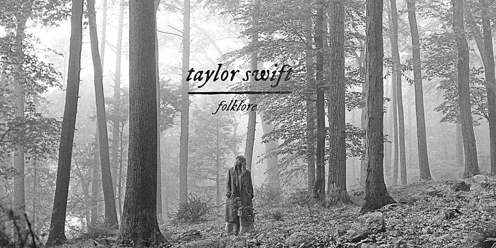

<!DOCTYPE html>
<html lang="en">
<head>
    <meta charset="UTF-8">
    <meta name="viewport" content="width=device-width, initial-scale=1.0">
    <title>Bismar Yamil Payihuanca Quino</title>
    <link rel="stylesheet" href="style/estilos.css">
    <link rel="stylesheet" href="css/bootstrap.min.css">
    
<body>
    

        

            
        

        

            
        

        

            <nav class="navbar navbar-expand-lg navbar-light bg-light" >
                

                  <a class="navbar-brand" href="#" >MENU</a>
                  <button class="navbar-toggler" type="button" data-bs-toggle="collapse" data-bs-target="#navbarNavDropdown" aria-controls="navbarNavDropdown" aria-expanded="false" aria-label="Toggle navigation">
                    
                  </button>
                  

                    <ul class="navbar-nav">
                      <li class="nav-item">
                        <a class="nav-link active" aria-current="page" href="biografia.html">BIOGRAFIA</a>
                      </li>
                      <li class="nav-item">
                        <a class="nav-link" href="carrera.html">CARRERA</a>
                      </li>
                      <li class="nav-item">
                        <a class="nav-link" href="materias.html">MATERIAS</a>
                      </li>
                      <li class="nav-item dropdown">
                        <a class="nav-link dropdown-toggle" href="#" id="navbarDropdownMenuLink" role="button" data-bs-toggle="dropdown" aria-expanded="false">
                          AFICIONES
                        </a>
                        <ul class="dropdown-menu" aria-labelledby="navbarDropdownMenuLink">
                          <li><a class="dropdown-item" href="#">DEPORTE</a></li>
                          <li><a class="dropdown-item" href="#">MUSICA</a></li>
                          <li><a class="dropdown-item" href="#">BAILE</a></li>
                          <li><a class="dropdown-item" href="#">COMIDA</a></li>
                        </ul>
                      </li>
                    </ul>
                  

                

              </nav>
        

        

            

                

                  

                    
                  

                  

                    
                  

                  

                    
                  

                  

                    
                  

                  

                    
                  

                  

                    
                  

                

                <button class="carousel-control-prev" type="button" data-bs-target="#carouselExampleControls" data-bs-slide="prev">
                  
                  Previous
                </button>
                <button class="carousel-control-next" type="button" data-bs-target="#carouselExampleControls" data-bs-slide="next">
                  
                  Next
                </button>
              

        

        

            

                

                  <h2 class="accordion-header" id="flush-headingOne">
                    <button class="accordion-button collapsed" type="button" data-bs-toggle="collapse" data-bs-target="#flush-collapseOne" aria-expanded="false" aria-controls="flush-collapseOne">
                      LA PAZ
                    </button>
                  </h2>
                  

                    
LA PAZ ES LA CEDE DE GOBIERNO

                  

                

                

                  <h2 class="accordion-header" id="flush-headingTwo">
                    <button class="accordion-button collapsed" type="button" data-bs-toggle="collapse" data-bs-target="#flush-collapseTwo" aria-expanded="false" aria-controls="flush-collapseTwo">
                      SANTA CRUZ
                    </button>
                  </h2>
                  

                    
ES EL DEPARTAMENTO QUE MAS PRODUCE

                  

                

                

                  <h2 class="accordion-header" id="flush-headingThree">
                    <button class="accordion-button collapsed" type="button" data-bs-toggle="collapse" data-bs-target="#flush-collapseThree" aria-expanded="false" aria-controls="flush-collapseThree">
                      COCHABAMBA
                    </button>
                  </h2>
                  

                    
ES LA CAPITAL DE LA COMIDA

                  

                

                

                    <h2 class="accordion-header" id="flush-headingFour">
                      <button class="accordion-button collapsed" type="button" data-bs-toggle="collapse" data-bs-target="#flush-collapseFour" aria-expanded="false" aria-controls="flush-collapseFour">
                        TARIJA
                      </button>
                    </h2>
                    

                      
ES LA CAPITAL DEL VINO Y LO CHAPACO 

                    

                  

              

        

        

            

                
                

                  <h5 class="card-title">ALBUN DE MUSICA</h5>
                  
Folklore es el octavo álbum de estudio de la cantante estadounidense Taylor Swift. Fue un álbum sorpresa, lanzado a través de Republic Records el 24 de julio de 2020, once meses después de su predecesor, Lover.

                  
                  <button type="button" class="btn btn-primary" data-bs-toggle="modal" data-bs-target="#staticBackdrop">
                    ESCUCHAR
                  </button>
                  
                  <!-- Modal -->
                  

                    

                      

                        

                          <h5 class="modal-title" id="staticBackdropLabel">FOLKLORE</h5>
                          <button type="button" class="btn-close" data-bs-dismiss="modal" aria-label="Close"></button>
                        

                        

                            1.The 1
                            2.Cardigan
                            3.The last great american dynasty
                            4.Exile - con Bon Iver
                            5.My tears ricochet
                            6.Mirrorball
                            7.Seven
                            8.August
                            9.This is me trying
                            10.Illicit affairs
                            11.Invisible string
                            12.Mad woman
                            13.Apiphany
                            14.Betty
                            15.Peace
                            16.Hoax
                            17.The lakes - bonus track
                        

                        

                          <button type="button" class="btn btn-secondary" data-bs-dismiss="modal">CERRAR</button>
                          <button type="button" class="btn btn-primary">IR</button>
                        

                      

                    

                  

                

              

        

        

            <button type="button" class="btn btn-primary">
                <a href="https://www.facebook.com/?locale=es_LA" style="color: white ;">FACEBOOCK</a></button>
            <button type="button" class="btn btn-secondary">
                <a href="https://getbootstrap.com/docs/5.3/getting-started/introduction/" style="color: white ";>BOOTSTRAP</a></button>
            <button type="button" class="btn btn-success">
                <a href="https://www.instagram.com/?hl=es" style="color: white ;">INSTAGRAM</a></button>
        

    

</body>
</html>
